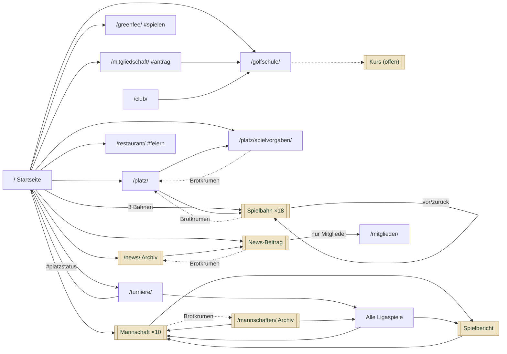
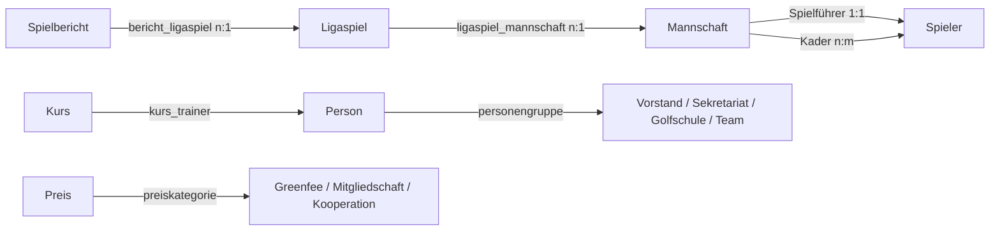

# Seitenstruktur – Stand 2026-09-25

Welche Seite welche Inhalte hat, woher die Inhalte kommen und wie die Seiten miteinander verknüpft sind. Die Doku unterscheidet zwischen **festen Seiten** und **Templates**. Fachlicher Rahmen: [projekt.md](projekt.md). Beitragstypen und Felder: [umsetzung.md](umsetzung.md). Vorlage für Aufbau und Gestaltung: [Prototyp](../prototype/README.md).

## Begriffe

| Art | Was es ist | Gepflegt von | Umsetzung in Etch |
| --- | --- | --- | --- |
| **Feste Seite** | Eine WordPress-Seite (`page`), die es genau einmal gibt. Aufbau und Texte sind individuell. Sie kann Loops enthalten, die strukturierte Inhalte ausgeben (z. B. Preise, Personen). | Aufbau: Agentur. Texte: Sekretariat, soweit freigegeben | Seite in Etch bauen, wiederkehrende Teile als Komponenten |
| **Template** | Eine Vorlage, die für **beliebig viele Einträge** eines Beitragstyps gilt. Der Inhalt kommt vollständig aus den Feldern des Eintrags. | Aufbau: Agentur. Inhalte: Sekretariat bzw. Spielführer über den Beitragstyp | Etch-Template: **Single** (ein Eintrag) oder **Archiv** (Liste aller Einträge) |
| **Globaler Bereich** | Teile, die auf jeder Seite erscheinen (Kopf, Fuß). | Agentur, Daten aus Einstellungsseiten | Etch-Template für Header/Footer |

Faustregel: Legt das Sekretariat im Betrieb neue Einträge an, ohne dass eine Seite gebaut wird, ist es ein Template. Sonst ist es eine feste Seite.

**Zentrale Clubdaten:** Wo unten `club`, `restaurant` oder `abschlaege` als Quelle steht, sind die gleichnamigen Tabs der Einstellungsseite **`clubdaten`** gemeint (WordPress-Menü „Clubdaten“). Abruf in Etch mit `{options.metabox.clubdaten.<feld>}`, Details in [umsetzung.md](umsetzung.md#zentrale-clubdaten-einstellungsseite-clubdaten).

## Übersicht

| Bereich | URL | Art | Datenquelle | Prototyp |
| --- | --- | --- | --- | --- |
| Startseite | `/` | Feste Seite | `sperrung`, `platzstatus`, `post`, `ligaspiel`, `spielbahn`, `abschlaege`, `preis`, `club`, `restaurant` | [index.html](../prototype/index.html) |
| Platz & Bahnen | `/platz/` | Feste Seite | `spielbahn`, `abschlaege` | [platz/](../prototype/platz/index.html) |
| Birdiebook (Vollbild) | `/platz/birdiebook/` | Feste Seite + Template `page-birdiebook` | `spielbahn`, `platzstatus` | – (nur WordPress) |
| Spielbahn | `/platz/bahn/<nr>/` | **Template (Single)** | `spielbahn` | [platz/bahn-1/](../prototype/platz/bahn-1/index.html) |
| Spielvorgaben | `/platz/spielvorgaben/` | Feste Seite | `abschlaege` | [platz/spielvorgaben/](../prototype/platz/spielvorgaben/index.html) |
| Zählkarte | `/platz/zaehlkarte/` | Feste Seite | `abschlaege`, `spielbahn` | [platz/zaehlkarte/](../prototype/platz/zaehlkarte/index.html) |
| Greenfee & Preise | `/greenfee/` | Feste Seite | `preis` (Greenfee, Kooperation), `club` | [greenfee/](../prototype/greenfee/index.html) |
| Mitgliedschaft | `/mitgliedschaft/` | Feste Seite | `preis` (Mitgliedschaft) | [mitgliedschaft/](../prototype/mitgliedschaft/index.html) |
| Turniere & Kalender | `/turniere/` | Feste Seite | PC CADDIE (`pccaddie_code`) | [turniere/](../prototype/turniere/index.html) |
| Golfschule | `/golfschule/` | Feste Seite | `kurs`, `person` (Golfschule), `club` | [golfschule/](../prototype/golfschule/index.html) |
| Kurs | `/golfschule/kurs/<slug>/` | **Template (Single)**, offen | `kurs` | – (siehe [Offene Punkte](#offene-punkte)) |
| Mannschaften | `/mannschaften/` | **Template (Archiv)** | `mannschaft`, `ligaspiel` | [mannschaften/](../prototype/mannschaften/index.html) |
| Mannschaft | `/mannschaften/<slug>/` | **Template (Single)** | `mannschaft`, `spieler`, `ligaspiel`, `spielbericht` | [mannschaften/ak30-herren/](../prototype/mannschaften/ak30-herren/index.html) |
| Alle Ligaspiele | `/mannschaften/ligaspiele/` (URL offen) | Feste Seite | `ligaspiel`, `mannschaft`, `spielbericht` | [mannschaften/ligaspiele/](../prototype/mannschaften/ligaspiele/index.html) |
| Spielbericht | `/spielberichte/<slug>/` | **Template (Single)** | `spielbericht`, `ligaspiel`, `mannschaft` | [spielberichte/…](../prototype/spielberichte/clubmannschaft-spieltag-3/index.html) |
| Restaurant & Veranstaltungen | `/restaurant/` | Feste Seite | `restaurant` | [restaurant/](../prototype/restaurant/index.html) |
| Aktuelles | `/news/` | **Template (Archiv)** | `post` | [news/](../prototype/news/index.html) |
| News-Beitrag | `/news/<slug>/` | **Template (Single)** | `post` | [news/…](../prototype/news/neue-terrasse/index.html) |
| Club & Kontakt | `/club/` | Feste Seite | `person`, `club` | [club/](../prototype/club/index.html) |
| Mitgliederbereich | `/mitglieder/` | Feste Seite | WordPress-Login, Seiten/Beiträge mit `nur_mitglieder` | [mitglieder/](../prototype/mitglieder/index.html) |
| Impressum | `/impressum/` | Feste Seite | Freitext | [impressum/](../prototype/impressum/index.html) |
| Datenschutz | `/datenschutz/` | Feste Seite | Freitext | [datenschutz/](../prototype/datenschutz/index.html) |
| 404 | – | Template | – | – |

Nicht öffentlich und ohne eigene Seite: `sperrung`, `spieler`, `ligaspiel`, `preis`, `person`. Sie erscheinen nur über Loops auf anderen Seiten.

---

## Globale Bereiche

### Header

| Teil | Inhalt | Quelle | Verlinkt auf |
| --- | --- | --- | --- |
| Top-Bar (`top-bar`, `course-status`) | Ampel „Platzstatus“ (frei / eingeschränkt / gesperrt) mit Zusätzen „Wintergrüns“, „Trolley-Verbot“, „Buggy-Verbot“, Telefon, Mitglieder-Login | `sperrung`, `platzstatus`, `club_telefon` | Startseite `#platzstatus`, `tel:`, `/mitglieder/` |
| Logo | Clublogo | – | `/` |
| Hauptnavigation (EtchMegaMenuPro) | „Golf spielen“ (Untermenü: Platz & Bahnen, Spielvorgaben, Zählkarte, Greenfee & Preise, Turniere & Kalender, Golfschule), Mitgliedschaft, Mannschaften, Restaurant, Aktuelles, Club & Kontakt; letzter Punkt „Als Gast spielen“ als Button | EMMP-Komponenten, Menüpunkte in `wordpress/etch/header.mjs` | jeweilige Seiten |
| CTA-Button | „Als Gast spielen“ (keine Startzeitbuchung) | – | `/greenfee/#spielen` |

**Anforderungen**

- Die Ampel zeigt den Stand **jetzt** mit denselben Regeln wie der Platzstatus auf der Startseite: rot bei gesperrtem Platz, gelb bei gesperrtem Abschlag, Wintergrüns, Trolley- oder Buggy-Verbot, sonst grün.
- Der aktive Menüpunkt wird mit `main-nav__item--active` bzw. `main-nav__submenu-item--active` und `aria-current="page"` markiert. Auf Bahn-, Mannschafts- und Spielberichtsseiten ist der jeweilige Elternbereich aktiv.
- Mobil klappt die Navigation über den Menü-Button auf. Skip-Link „Zum Inhalt springen“ steht als erstes Element.

### Footer

| Teil | Inhalt | Quelle |
| --- | --- | --- |
| Marke | Logo, Adresse, Telefon, E-Mail | `club` |
| Sekretariat | Öffnungszeiten mit „Jetzt geöffnet/geschlossen“ und kommenden Ausnahmen | `zeiten_sekretariat_*` (Komponente Öffnungszeiten) |
| Navigation „Golf“ | Platz & Bahnen, Greenfee & Preise, Turniere, Golfschule, Mannschaften | WordPress-Menü |
| Navigation „Club“ | Mitglied werden, Restaurant & Events, Aktuelles, Club & Kontakt, Mitgliederbereich | WordPress-Menü |
| Fußzeile | © Jahr + Clubname, Impressum, Datenschutz | `club_name` |

---

## Feste Seiten

### Startseite `/`

**Zweck:** Einstieg für alle Zielgruppen, aktueller Platzstatus auf einen Blick.

| # | Abschnitt | Inhalt | Quelle | Verlinkt auf |
| --- | --- | --- | --- | --- |
| 1 | Hero (`home-hero`) | Begrüßung, Claim, zwei Buttons; daneben (mobil darunter) die **Platzstatus-Kurzfassung** (`status-summary`): Zustand jetzt mit Ampelfarbe, heutige Sperren von Platz und Abschlägen, Grüns/Trolleys/Buggies – sofort sichtbar ohne Scrollen | Text der Seite, `club_name`, `club_claim`; Komponente PlatzstatusKurz | `/greenfee/#spielen`, `/mitgliedschaft/`, `#platzstatus` |
| 2 | Platzstatus (`status-board`, Anker `#platzstatus`) | Spielbedingungen (Sommer-/Wintergrüns, Trolleys, Buggies/E-Carts); Sperren für Platz und Abschläge heute und morgen: Bereich, Zeitraum, Grund; Übungsanlagen & Proshop: jetzt geöffnet/gesperrt plus anstehende Sperren | `sperrung`, `platzstatus` | `/greenfee/#oeffnungszeiten` |
| 3 | Einstiege (`entry-card`, 4×) | Mitglied werden, Als Gast spielen (mit „Greenfee ab …“), Golf lernen, Genießen & Feiern | Texte; niedrigster Greenfee-Preis aus `preis` | `/mitgliedschaft/`, `/greenfee/`, `/golfschule/`, `/restaurant/` |
| 4 | Der Platz (`stats`, `hole-strip`) | Kurztext, Kennzahlen (Bahnen, Par, Länge Gelb, CR/Slope Gelb), drei Bahnen als Teaser | `spielbahn`, `abschlaege` | `/platz/`, `/platz/spielvorgaben/`, drei Bahnseiten |
| 5 | Aktuelles (`news-card`, 3×) | Die drei neuesten Beiträge | `post` | Beitrag, `/news/` |
| 6 | Nächste Ligaspiele (`event-list`) | Die nächsten 4 Ligaspiele: Datum, Mannschaft, Spielort, Heimspiel | `ligaspiel`, `mannschaft` | Mannschaftsseite, `/turniere/` |
| 7 | Restaurant (`feature-band`) | Teaser, Öffnungszeiten, Zitat | `zeiten_restaurant_*`, `restaurant_hinweis` | `/restaurant/`, `/restaurant/#feiern` |
| 8 | Als Gast spielen (`guest-info`) | Keine festen Startzeiten, Anmeldung am Wochenende empfohlen, Pflegetag, Anmeldetelefon, E-Mail, Öffnungszeiten Sekretariat | `clubdaten` (`anmeldung_*`, `ruhetag_hinweis`, `club_email`, `club_oeffnungszeiten`) | `tel:`, `mailto:` |

**Anforderungen**

- Platzstatus nach den Regeln aus [projekt.md › Anzeige auf der Startseite](projekt.md#anzeige-auf-der-startseite): Schnellsperre zuerst und hervorgehoben, abgelaufene Sperren verschwinden, ohne Sperren „Platz uneingeschränkt bespielbar“. Abfrage siehe [umsetzung.md](umsetzung.md#abfragen-für-die-etch-templates).
- Die Seite nicht oder nur kurz cachen, sonst ist der Platzstatus veraltet.
- Kennzahlen werden aus den Bahn- und Abschlagdaten berechnet, nicht als Text gepflegt.
- Beiträge mit `nur_mitglieder` erscheinen im Teaser, der Volltext bleibt geschützt.

### Platz & Bahnen `/platz/`

**Zweck:** Den Platz vorstellen, vor allem für Greenfee-Gäste.

| # | Abschnitt | Inhalt | Quelle | Verlinkt auf |
| --- | --- | --- | --- | --- |
| 1 | Seitenkopf (`page-hero`) | Brotkrumen, Titel, Kennzahlen im Lead (Par, Länge Gelb), Knöpfe „Birdiebook öffnen“ und „Zur Scorekarte“ | `spielbahn` | `/platz/birdiebook/`, `#scorekarte` |
| 1a | **Birdiebook** (Komponente `Birdiebook`, Anker `#birdiebook`) | Eine Bahn pro Slide (EtchSliderPro): Nummer, Status, Länge und Par zum gewählten Abschlag, HCP, Bahngrafik mit Hindernissen, Entfernungen zur Grünmitte, Spieltipp; Bedienleiste mit Abschlag-Wahl, Nummern 1–18, Vor/Zurück; Direktlink `#bahn-7` | `spielbahn` (Loop `gp-bahnen`), `platzstatus`, `sperrung` | Bahnseite („Mehr zur Bahn“), Konzept: [konzept-birdiebook.md](konzept-birdiebook.md) |
| 2 | Platzbeschreibung | Freitext zur Anlage | Text der Seite | Signaturbahn, `/platz/spielvorgaben/` |
| 3 | Course & Slope Rating (`rating-table`) | Je Abschlag: Gesamtlänge, CR/Slope/Par für Herren und Damen | `abschlaege`, Länge aus `spielbahn` summiert | – |
| 4 | Alle 18 Bahnen (`hole-card`) | Grafik, Nummer, Name, Par, HCP, Länge Gelb | `spielbahn`, sortiert nach `bahn_nummer` | Bahnseite |
| 5 | Scorekarte (`scorecard`, Anker `#scorekarte`) | Loch, Par, HCP, Länge je Abschlag; Summen Out/In/Gesamt | `spielbahn` | Bahnseite (Lochnummer) |

**Anforderungen**

- Keine Zahl wird doppelt gepflegt: Summen und Längen kommen aus den Bahnen, Ratings aus der Einstellungsseite `abschlaege`.
- Die Scorekarte ist auf dem Smartphone horizontal scrollbar (`table-wrap`).

### Spielvorgaben `/platz/spielvorgaben/`

**Zweck:** Spielern die Spielvorgabe je Abschlag zeigen.

| # | Abschnitt | Inhalt | Quelle |
| --- | --- | --- | --- |
| 1 | Seitenkopf | Brotkrumen Platz & Bahnen › Spielvorgaben | – |
| 2 | Rechner (`calculator`) | Eingabe Handicap-Index (+5,0 bis 54,0), Ergebnis je Abschlag für Herren und Damen | `abschlaege` |
| 3 | Erklärung | WHS-Formel, Rating-Tabelle | Text, `abschlaege` |
| 4 | Tabellen (`tabs`, `hcp-table`) | Je Abschlag ein Tab, darin Herren und Damen: Handicap-Index-Spanne → Spielvorgabe | `abschlaege` |
| 5 | Verweis Zählkarte | Kurztext und Link auf `/platz/zaehlkarte/` | – |

**Anforderungen**

- Tabellen und Rechner werden aus CR, Slope und Par berechnet (Formel wie in [main.js](../prototype/assets/js/main.js)). Ändert der Verband die Werte, wird nur die Einstellungsseite angepasst.
- Eingabe mit Komma und Plus-Handicap („+1,2“), Fehlermeldung außerhalb des gültigen Bereichs.
- Tabs über OhMyEtch Tabs, per Tastatur bedienbar.

### Zählkarte `/platz/zaehlkarte/`

**Zweck:** Während oder nach der Runde mitzählen – Vorgabeschläge je Loch, Brutto, Netto und Stableford. Im Menü unter „Golf spielen“.

| # | Abschnitt | Inhalt | Quelle |
| --- | --- | --- | --- |
| 1 | Seitenkopf | Brotkrumen Platz & Bahnen › Zählkarte | – |
| 2 | Zählkarte (`score-calc`, Komponente Zaehlkarte) | Handicap-Index und Abschlag wählen → Vorgabeschläge je Loch; Schläge eintragen → Netto je Loch, Stableford brutto/netto, Summen Out/In/Gesamt. Eingaben bleiben im Browser. „Ergebnis teilen“: auf dem Handy als HTML-Datei (runde-JJJJ-MM-TT.html) über das Teilen-Menü, am PC als formatierte HTML-Tabelle in der Zwischenablage (für E-Mail), Textfassung für Messenger (Loch, Par, Vorgabe, Schläge, Netto, Stableford netto; Out/In/Gesamt; in ``` für Festbreitenschrift in Messengern) plus Link mit der Runde im Anker (`#runde=gelb;16,4;5.4.6.-…`); der Link zeigt die geteilte Runde, ohne die eigene zu überschreiben. „Als HTML speichern“ lädt dieselbe Datei herunter (Inline-Styles, Farben aus den ACSS-Tokens zur Laufzeit in RGB, immer helles Schema) | `abschlaege`, `spielbahn` (Par, HCP) |
| 3 | Erklärung | So wird gezählt (WHS, Stableford), Link Spielvorgaben, Rating-Tabelle | Text, `abschlaege` |

### Greenfee & Preise `/greenfee/`

**Zweck:** Greenfee-Gäste informieren und zur Reservierung führen.

| # | Abschnitt | Inhalt | Quelle | Verlinkt auf |
| --- | --- | --- | --- | --- |
| 1 | Seitenkopf | Titel, Hinweis zur Platzreife | Text | – |
| 2 | Preisliste (`price-table`) | Greenfee-Preise mit Zusatz | `preis` mit `preiskategorie` = Greenfee, nach `menu_order` | – |
| 3 | Gut zu wissen (`check-list`) | Voraussetzungen, E-Cart, Leihschläger, Range | Text der Seite | – |
| 4 | Als Gast spielen (`guest-info`, Anker `#spielen`) | Keine festen Startzeiten, Anmeldung am Wochenende, Pflegetag, Kontakt, Öffnungszeiten | `clubdaten` | `tel:`, `mailto:` |
| 5 | Öffnungszeiten der Anlage (`facility-hours`, Anker `#oeffnungszeiten`) | Sekretariat, Driving Range, Kurzspielbereich, Proshop; gesperrte Einrichtungen rot markiert mit Grund und Ende | `clubdaten` › Öffnungszeiten, `platzstatus`, `sperrung` | – |
| 6 | Kooperationen (`card`) | Partnerclubs und Vorteile | `preis` mit `preiskategorie` = Kooperation | – |

**Anforderungen**

- Der Anker `#spielen` ist Ziel aller „Als Gast spielen“-Buttons und muss erhalten bleiben.
- Es gibt **keine Startzeitbuchung**. Die Seite nennt Greenfee, Leihgeräte (E-Buggy, Trolley, Schläger) und die Hinweise aus der Club-Website (Mitgliedsausweis, Handicap-Grenzen, Ermäßigungen).

### Mitgliedschaft `/mitgliedschaft/`

**Zweck:** Interessenten zur Mitgliedschaft führen.

| # | Abschnitt | Inhalt | Quelle | Verlinkt auf |
| --- | --- | --- | --- | --- |
| 1 | Seitenkopf | Titel, Lead | Text | – |
| 2 | Modelle (`price-card`) | Titel, Betrag, Einheit, Zusatz, Aufnahmegebühr, Leistungen, Hervorhebung „Beliebt“ | `preis` mit `preiskategorie` = Mitgliedschaft | `#antrag` |
| 3 | In drei Schritten (`steps`) | Kennenlernen, Beratung, Aufnahmeantrag | Text | `/golfschule/` |
| 4 | Aufnahmeantrag (Anker `#antrag`) | FAQ (`accordion`), Formular, PDF-Download | Text, Formular-Plugin, Mediathek | `/datenschutz/` |

**Anforderungen**

- Das Formular bietet die Modelle aus `preis` zur Auswahl an. Mit Einwilligungshinweis zum Datenschutz. **Stand:** noch nicht umgesetzt (kein Formular-Plugin); bis dahin Telefon, E-Mail und PDF.
- Die hervorgehobene Karte (`preis_hervorheben`) wird optisch betont.

### Turniere & Kalender `/turniere/`

**Zweck:** Clubturniere aus PC CADDIE zeigen, dazu das Lochwettspiel.

| # | Abschnitt | Inhalt | Quelle | Verlinkt auf |
| --- | --- | --- | --- | --- |
| 1 | Seitenkopf | Titel, Hinweis auf PC CADDIE | Text | – |
| 1a | Lochwettspiel (`#lochwettspiel`, Komponente „Lochwettspiel“, `jahr: aktuell`) | Turnierbaum des laufenden Jahres: Runden mit Spielzeitraum und Status, Spiele, Ergebnisse, Sieger; Jahrgänge | `lochwettspiel` | `/turniere/lochwettspiel/<jahr>/` |
| 2 | Turnierbereich (`tabs`, `embed-placeholder`) | Tabs Turnierkalender, Meldung, Ergebnisse, je eine Einbettung | `pccaddie_code` | – |
| 3 | Ligaspiele | Hinweis, dass Ligaspiele auf der Website gepflegt werden | Text | Alle Ligaspiele |
| 4 | Abschlagsperren | Hinweis auf den Platzstatus | Text | `/#platzstatus` |

**Anforderungen**

- Ausnahme ist das **Lochwettspiel** (einmal im Jahr, Zweier-Teams, K.-o.-System mit festem Spielzeitraum je Runde). Es läuft nicht über PC CADDIE und wird deshalb im Beitragstyp `lochwettspiel` gepflegt; je Jahr gibt es eine Seite `/turniere/lochwettspiel/<jahr>/` (Template `single-lochwettspiel`: Turnierbaum und Ausschreibung aus dem Beitragstext).
- Alle übrigen Turniere werden **nicht** in WordPress gepflegt: Sie kommen stündlich aus PC CADDIE (Beitragstyp `turnier`, nur lesend) und erscheinen als Turnierkalender und Ergebnisliste; Anmeldung und Ergebnislisten verlinken zu PC CADDIE. Einbettung, Design-Anpassung und Consent sind offen (siehe [projekt.md › Offene Punkte](projekt.md#offene-punkte)).

### Golfschule `/golfschule/`

**Zweck:** Kurse anbieten, Pros vorstellen.

| # | Abschnitt | Inhalt | Quelle | Verlinkt auf |
| --- | --- | --- | --- | --- |
| 1 | Seitenkopf | Titel, Lead | Text | – |
| 2 | Kurse & Training (`course-card`) | Typ, Titel, Text, Preis, Dauer, max. Teilnehmer, Termine | `kurs` | Kursseite (falls Template kommt) |
| 3 | Anmeldung | Telefon, E-Mail mit Betreff „Kursanmeldung“ | `club`; bzw. `kurs_anmeldung` | `tel:`, `mailto:` |
| 4 | Team der Golfschule (`person-card`) | Pros mit Funktion und Kontakt | `person` mit `personengruppe` = Golfschule | – |
| 5 | Platzreife | Erklärtext | Text | – |

**Anforderungen**

- Vergangene Kurstermine werden ausgeblendet. Kurse ohne künftigen Termin bleiben sichtbar, wenn sie auf Anfrage stattfinden (z. B. Einzeltraining).
- Kurs ohne Preis zeigt „kostenlos“.

### Alle Ligaspiele `/mannschaften/ligaspiele/`

**Zweck:** Terminübersicht aller Mannschaften.

| # | Abschnitt | Inhalt | Quelle | Verlinkt auf |
| --- | --- | --- | --- | --- |
| 1 | Seitenkopf | Brotkrumen Mannschaften › Ligaspiele, Saison | – | `/mannschaften/` |
| 2 | Kommende Spiele (`match-table`) | Datum, Uhrzeit, Mannschaft, Spieltag, Spielort, Heimspiel | `ligaspiel` mit `ligaspiel_termin` ≥ heute, aufsteigend | Mannschaftsseite |
| 3 | Vergangene Spiele (`match-table`) | wie oben plus Platzierung und Link zum Bericht | `ligaspiel` mit `ligaspiel_termin` < heute, absteigend; `spielbericht` | Mannschaftsseite, Spielbericht |

**Anforderungen**

- Heimspiele sind hervorgehoben (`match-table__row--home`).
- Ohne kommende Spiele erscheint „Keine weiteren Spiele in dieser Saison.“
- URL beachten, siehe [Offene Punkte](#offene-punkte).

### Restaurant & Veranstaltungen `/restaurant/`

**Zweck:** Restaurant und Feiern vermarkten, auch an Nicht-Golfer.

| # | Abschnitt | Inhalt | Quelle | Verlinkt auf |
| --- | --- | --- | --- | --- |
| 1 | Seitenkopf | Name des Restaurants, Lead | `restaurant_name` | – |
| 2 | Hinweis | z. B. Betriebsferien, nur wenn gefüllt | `restaurant_hinweis` | – |
| 3 | Öffnungszeiten, Reservierung | Öffnungszeiten (Standard, Ausnahmen, jetzt geöffnet), Button „Tisch reservieren“ nur mit Telefonnummer | `zeiten_restaurant_*`, `restaurant_telefon` | `tel:` |
| 4 | Speisekarte (`menu-card`) | Auszug und PDF | `restaurant_speisekarte` | PDF |
| 5 | Feiern & Firmenevents (Anker `#feiern`) | Familienfeiern, Hochzeiten, Firmen-Golf-Tag | Text der Seite | – |
| 6 | Veranstaltung anfragen | Formular (Anlass, Wunschtermin, Gäste) | Formular-Plugin | – |

**Anforderungen**

- Das Sekretariat pflegt Speisekarte und Hinweis selbst, ohne die Seite in Etch zu öffnen. Ob der Auszug als Text oder nur als PDF gepflegt wird, ist offen.

### Club & Kontakt `/club/`

**Zweck:** Ansprechpartner, Anfahrt und Kontakt.

| # | Abschnitt | Inhalt | Quelle | Verlinkt auf |
| --- | --- | --- | --- | --- |
| 1 | Seitenkopf | Titel, Lead | Text | – |
| 2 | Sprungnavigation (`subnav`) | Vorstand, Team, Jugend, Anfahrt, Kontakt | – | Anker der Seite |
| 3 | Vorstand (`#vorstand`) | Personenkarten | `person` / Vorstand | – |
| 4 | Sekretariat & Team (`#team`) | Personenkarten | `person` / Sekretariat, Team, Golfschule | – |
| 5 | Jugend (`#jugend`) | Text, Jugendwart/in | Text, `person` | `/golfschule/` |
| 6 | Anfahrt (`#anfahrt`) | Adresse, Wegbeschreibung, Karte | `club_adresse`, Text | – |
| 7 | Kontakt (`#kontakt`) | Telefon, E-Mail, Öffnungszeiten, Formular | `club`, Formular-Plugin | `tel:`, `mailto:` |

**Anforderungen**

- Die Karte ist ein statisches Bild oder wird erst nach Einwilligung geladen.
- Die Person für „Jugend“ wird im Prototyp über die Funktion gefunden. In WordPress besser eine eigene Gruppe „Jugend“ in `personengruppe` oder eine feste Auswahl.

### Mitgliederbereich `/mitglieder/`

**Zweck:** Anmeldung und interne Inhalte für Mitglieder.

| # | Abschnitt | Inhalt | Quelle |
| --- | --- | --- | --- |
| 1 | Seitenkopf | Titel, Hinweis | Text |
| 2 | Login (`login-box`) | Benutzername/E-Mail, Passwort, „Passwort vergessen?“ | WordPress-Login |
| 3 | Inhalte nach Anmeldung | Liste der internen Seiten, Beiträge und Downloads | Seiten/Beiträge mit `nur_mitglieder` |

**Anforderungen**

- Nicht angemeldet: Login und Beschreibung. Angemeldet: Liste der geschützten Inhalte statt Login.
- Rolle „Mitglied“ (nur `read`), siehe [umsetzung.md](umsetzung.md#noch-von-hand-zu-erledigen). Welche Inhalte hinein gehören, ist offen.

### Impressum `/impressum/`, Datenschutz `/datenschutz/`

Freitext im Editor, Lieferung durch den Club. Beide sind im Footer verlinkt, Datenschutz zusätzlich aus allen Formularen.

---

## Templates

### Spielbahn (Single) `/platz/bahn/<nr>/`

Gilt für alle 18 Einträge von `spielbahn`.

| # | Abschnitt | Inhalt | Feld |
| --- | --- | --- | --- |
| 1 | Seitenkopf | Brotkrumen Platz & Bahnen › Bahn n, „Hole by Hole · n von 18“, Titel „Bahn n“, Par Herren/Damen · HCP | `bahn_nummer`, `bahn_par_herren`, `bahn_par_damen`, `bahn_hcp` |
| 2 | Bahngrafik (`hole-detail__map`) | Luftbild bzw. Grafik | `bahn_grafik` |
| 3 | Kennzahlen (`hole-facts`) | Par Herren, Par Damen, HCP, Länge je Abschlag (mit Geschlecht: Gelb/Blau Herren, Rot/Orange Damen) | `bahn_par_herren`, `bahn_par_damen`, `bahn_hcp`, `laenge_*` |
| 4 | Die Bahn | Beschreibung | `bahn_beschreibung` |
| 5 | Spieltipp (`tip`) | Tipp vom Pro | `bahn_spieltipp` |
| 6 | Video (`hole-video`) | `<video controls preload="none" poster="…">` | `bahn_video`, `bahn_video_poster` |
| 7 | Bilder | Galerie, falls gefüllt | `bahn_bilder` |
| 8 | Bahn-Navigation (`hole-pager`) | Vorherige/nächste Bahn, Nummern 1–18 | alle `spielbahn` nach `bahn_nummer` |

**Anforderungen**

- Vorherige/nächste Bahn nach `bahn_nummer`, nicht nach Veröffentlichungsdatum. Bahn 18 verlinkt als „Nächste“ auf die Platzübersicht.
- Leere Felder (Video, Bilder, Spieltipp) blenden ihren Abschnitt aus.
- Seitentitel: „Bahn n – Kurzname“, Meta-Beschreibung aus `bahn_beschreibung`.

### Mannschaften (Archiv) `/mannschaften/`

| # | Abschnitt | Inhalt | Quelle | Verlinkt auf |
| --- | --- | --- | --- | --- |
| 1 | Seitenkopf | Titel, Anzahl Mannschaften | Anzahl `mannschaft` | – |
| 2 | Mannschaftskarten (`team-card`) | Liga, Name, Spielführer, nächstes Spiel (Datum, Spielort) oder „Saison beendet“ | `mannschaft`, `mannschaft_spielfuehrer`, nächstes `ligaspiel` der Mannschaft | Mannschaftsseite |
| 3 | Button | „Alle Ligaspiele im Überblick“ | – | `#ligaspiele` |
| 4 | Alle Ligaspiele (`#ligaspiele`, `match-table`) | Kommende und vergangene Spiele aller Mannschaften, Heimspiele hervorgehoben, Link zum Spielbericht | `ligaspiel`, `spielbericht` | Mannschaftsseite, Spielbericht |

**Anforderungen**

- Feste Reihenfolge: Clubmannschaft, dann AK30, AK50, AK65, jeweils Damen vor Herren und /1 vor /2 (Sortierung über `menu_order` oder Altersklasse + Nummer + Geschlecht).

### Mannschaft (Single) `/mannschaften/<slug>/`

Gilt für alle 10 Einträge von `mannschaft`.

| # | Abschnitt | Inhalt | Quelle | Verlinkt auf |
| --- | --- | --- | --- | --- |
| 1 | Seitenkopf | Brotkrumen Mannschaften › Name, Liga | `mannschaft_liga` | `/mannschaften/` |
| 2 | Mannschaftsfoto | Beitragsbild | Beitragsbild der Mannschaft | – |
| 3 | Ligaspiele (`match-table` ohne Spalte Mannschaft) | Alle Spiele der Mannschaft, chronologisch | `ligaspiel` mit `ligaspiel_mannschaft` = aktuelle Mannschaft | Spielbericht |
| 4 | Spielberichte (`report-list`) | Titel und Datum | `spielbericht` mit `bericht_ligaspiel` IN (Ligaspiele dieser Mannschaft) | Spielbericht |
| 5 | Spielführer (`side-box`) | Name | `mannschaft_spielfuehrer` → `spieler` | – |
| 6 | Kader (`roster`) | Namen, Kennzeichnung Spielführer | `mannschaft_kader` → `spieler` | – |

**Anforderungen**

- Es erscheinen nur Spieler mit `spieler_einwilligung`. Das gilt auch für den Spielführer.
- Abschnitt Spielberichte nur, wenn es Berichte gibt.
- Ein Spieler kann in mehreren Mannschaften stehen (n : m), er wird trotzdem nur einmal gepflegt.

### Spielbericht (Single) `/spielberichte/<slug>/`

| # | Abschnitt | Inhalt | Quelle | Verlinkt auf |
| --- | --- | --- | --- | --- |
| 1 | Seitenkopf | Brotkrumen Mannschaften › Mannschaft › Spielbericht; Mannschaft · Spieltag · Datum; Titel | `bericht_ligaspiel` → `ligaspiel` → `ligaspiel_mannschaft` | `/mannschaften/`, Mannschaftsseite |
| 2 | Meta (`article-meta`) | Autor, Spielort, Platzierung | Autor des Beitrags, `ligaspiel_spielort`, `ligaspiel_platzierung` | – |
| 3 | Text | Berichtstext | Editor | – |
| 4 | Bilder | Galerie | `bericht_bilder` | – |
| 5 | Rücklink | „Zur Mannschaft …“ | Mannschaft über das Ligaspiel | Mannschaftsseite |

**Anforderungen**

- Die Mannschaft wird nie direkt am Bericht gepflegt, sondern immer über das Ligaspiel ermittelt.
- Im Menü ist „Mannschaften“ aktiv.

### Aktuelles (Archiv) `/news/`

| # | Abschnitt | Inhalt | Quelle |
| --- | --- | --- | --- |
| 1 | Seitenkopf | Titel | – |
| 2 | Beitragskarten (`news-card`) | Bild, Kategorie, Datum, Titel, Teaser, Schloss bei Mitglieder-Beiträgen | `post`, neueste zuerst |
| 3 | Seitenzahlen | Blättern | WordPress-Pagination |

**Anforderungen**

- Kategorie-Archive (z. B. `/news/kategorie/<slug>/`) nutzen dasselbe Template.
- Die Seite `/news/` wird unter Einstellungen → Lesen als Beitragsseite gesetzt, oder die Beitrags-URL wird auf `/news/%postname%/` gestellt.

### News-Beitrag (Single) `/news/<slug>/`

| # | Abschnitt | Inhalt | Quelle | Verlinkt auf |
| --- | --- | --- | --- | --- |
| 1 | Seitenkopf | Brotkrumen Aktuelles › Titel, Kategorie · Datum | `post` | `/news/` |
| 2 | Teaser (`lead`) | Auszug | Textauszug | – |
| 3 | Inhalt | Beitragstext oder Mitglieder-Sperre (`members-lock`) | Editor, `nur_mitglieder` | `/mitglieder/` |
| 4 | Rücklink | „Alle Nachrichten“ | – | `/news/` |

**Anforderungen**

- Ist `nur_mitglieder` an und niemand angemeldet, erscheinen nur Titel, Teaser und der Hinweis mit Anmelde-Button. Der Volltext darf dann auch nicht im HTML stehen.

### Kurs (Single) `/golfschule/kurs/<slug>/` – offen

Der Beitragstyp `kurs` ist öffentlich und hat eine eigene URL, im Prototyp gibt es aber keine Kursseite. Entweder ein Template bauen (Inhalt wie `course-card` plus Trainer aus `kurs_trainer` und Anmeldung aus `kurs_anmeldung`) oder `kurs` auf nicht öffentlich stellen. Siehe [Offene Punkte](#offene-punkte).

### 404

Kurzer Hinweis, Suche bzw. Links auf Startseite, Platz & Bahnen und Kontakt.

---

## Verknüpfungen

### Navigation zwischen den Seiten

Durchgezogene Pfeile sind Links im Inhalt, gestrichelte Pfeile die Rücklinks über Brotkrumen. Header und Footer verlinken zusätzlich jede Hauptseite.



Farbig und doppelt umrandet = Template, weiß = feste Seite.

### Welche Daten wo erscheinen

Hilft bei der Frage „Wenn ich X ändere, welche Seiten ändern sich?“.

| Datenquelle | Erscheint auf |
| --- | --- |
| `sperrung` + Einstellungsseite `platzstatus` | Top-Bar (alle Seiten), Startseite |
| `spielbahn` | Startseite (Kennzahlen, 3 Bahnen), Platz & Bahnen (Karten, Scorekarte, Längen), Spielbahn-Template |
| Einstellungsseite `abschlaege` | Startseite (CR/Slope Gelb), Platz & Bahnen (Rating-Tabelle), Spielvorgaben (Rechner, Tabellen) |
| `preis` / Greenfee | Greenfee & Preise, Startseite („Greenfee ab …“) |
| `preis` / Mitgliedschaft | Mitgliedschaft (Karten, Auswahl im Formular) |
| `preis` / Kooperation | Greenfee & Preise |
| `kurs` | Golfschule, Kurs-Template (offen) |
| `person` | Golfschule (Golfschule), Club & Kontakt (alle Gruppen), Kurs (Trainer) |
| `mannschaft` | Mannschaften-Archiv, Mannschaft-Template, Startseite (nächste Ligaspiele), Alle Ligaspiele, Spielbericht |
| `spieler` | Mannschaft-Template (Kader, Spielführer), Mannschaften-Archiv (Spielführer) |
| `ligaspiel` | Startseite (nächste 4), Mannschaften-Archiv (nächstes Spiel), Mannschaft-Template, Alle Ligaspiele, Spielbericht (Kopf) |
| `spielbericht` | Mannschaft-Template, Alle Ligaspiele (Link beim Ergebnis), Spielbericht-Template |
| `post` | Startseite (3 neueste), News-Archiv, News-Template, Mitgliederbereich (geschützte) |
| Einstellungsseite `club` | Header (Telefon), Footer, „Als Gast spielen“ (Startseite, Greenfee), Golfschule (Anmeldung), Club & Kontakt, Turniere (`pccaddie_code`) |
| Einstellungsseite `restaurant` | Startseite (Öffnungszeiten), Restaurant |

### Datenbeziehungen hinter den Templates



## Gemeinsame Anforderungen

- **Seitenkopf:** Jede Seite außer der Startseite hat einen `page-hero` mit Brotkrumen, die der URL-Hierarchie folgen.
- **Seitentitel:** „Titel – Kurzname des Clubs“, auf der Startseite nur der Clubname.
- **Keine Doppelpflege:** Kontaktdaten, Öffnungszeiten, Preise, Bahn- und Abschlagdaten stehen nur in ihren Feldern bzw. Einstellungsseiten und werden überall von dort gelesen.
- **Leere Felder:** Ein Abschnitt, dessen Quelle leer ist, wird ausgeblendet, statt leer zu erscheinen.
- **Formulare:** Formular-Plugin, Hinweis mit Link auf `/datenschutz/`.
- **Keine externen Dienste** ohne Einwilligung (Schriften, Karten, Videos). Ausnahme nach Klärung: PC CADDIE.
- **Barrierefreiheit:** Skip-Link, `aria-current` in Navigation und Bahn-Navigation, Tabellen mit `scope`, Tabs und Akkordeons per Tastatur bedienbar.
- **BEM:** Klassennamen wie im Prototyp, siehe [development-environment.md](development-environment.md#konventionen).

## Offene Punkte

- [x] **URL „Alle Ligaspiele“:** gelöst als Abschnitt `#ligaspiele` im Mannschaften-Archiv (`/mannschaften/#ligaspiele`), weil `/mannschaften/ligaspiele/` mit den Mannschafts-URLs kollidiert.
- [x] **URL Spielbahnen:** festgelegt auf `/platz/bahn/1/` … `/platz/bahn/18/` (Slug = Bahnnummer). Die Bahnen haben keine Namen. Offen bleibt nur, ob `/platz/bahn/` auf `/platz/` weiterleitet.
- [ ] **Kurs-Template:** Kursseiten bauen oder `kurs` auf nicht öffentlich stellen.
- [ ] **Speisekarte:** Auszug auf der Seite als Text pflegen oder nur PDF (`restaurant_speisekarte`)?
- [ ] **Jugend:** Personengruppe „Jugend“ ergänzen oder die Person fest auswählen.
- [ ] **Veranstaltungsangebote** (Familienfeiern, Hochzeiten, Firmen-Golf-Tag) als Freitext der Seite lassen oder strukturiert pflegen?
- [ ] **Mitgliederbereich:** Inhalte und Unterseiten festlegen (siehe [projekt.md](projekt.md#offene-punkte)).
